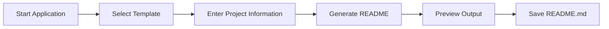

<div align="center">

# 🚀 README Generator

### Generate professional GitHub README files in minutes

[]()
[]()
[]()
[]()

*A powerful CLI tool that creates polished, structured, and production-ready README files through an interactive terminal experience.*

</div>

---

## ✨ Features

- 🎯 Interactive command-line interface
- 📄 Multiple README templates
- 🐍 Python project template
- ☕ Java project template
- 🤖 Machine Learning project template
- 🌐 Web Development project template
- 👀 Live README preview before export
- 🛡️ File overwrite protection
- 📁 Custom output directory support
- 🧩 Modular and extensible architecture
- ⚡ Fast template rendering with Jinja2
- 🎨 Rich terminal experience using Rich

---

## 🏗️ Architecture

```text
readme-generator
│
├── readme_generator
│   ├── main.py
│   ├── input_handler.py
│   ├── template_engine.py
│   ├── file_manager.py
│   ├── validator.py
│   └── config.py
│
├── templates
│   ├── python_project.md
│   ├── java_project.md
│   ├── ml_project.md
│   └── web_project.md
│
├── tests
├── output
├── requirements.txt
└── setup.py
```

---

## 🛠️ Tech Stack

| Category | Technology |
|-----------|------------|
| Language | Python |
| Templates | Jinja2 |
| Terminal UI | Rich |
| User Input | Questionary |
| Testing | Pytest |
| Packaging | setuptools |

---

## 🚀 Quick Start

### 1. Clone the Repository

```bash
git clone https://github.com/your-username/readme-generator.git
cd readme-generator
```

### 2. Create Virtual Environment

```bash
python -m venv venv
```

### 3. Activate Environment

**Windows**

```bash
venv\Scripts\activate
```

**Linux / macOS**

```bash
source venv/bin/activate
```

### 4. Install Dependencies

```bash
pip install -r requirements.txt
```

### 5. Run the Application

```bash
python -m readme_generator.main
```

---

## 📋 How It Works



---

## 📂 Example Workflow

1. Launch the application
2. Choose a project category
3. Enter project details
4. Review the generated markdown
5. Select output location
6. Export README.md

Result:

```bash
✅ README generated successfully!
📄 Saved to: output/README.md
```

---

## 🧪 Running Tests

```bash
pytest
```

Run with coverage:

```bash
pytest --cov=readme_generator
```

---

## 🔮 Roadmap

- [ ] Custom template creation
- [ ] GitHub API integration
- [ ] Automatic badge generation
- [ ] AI-assisted README writing
- [ ] GUI/Desktop version
- [ ] Template marketplace
- [ ] README quality scoring

---

## 🤝 Contributing

Contributions are welcome.

```bash
# Fork repository
# Create feature branch
git checkout -b feature/amazing-feature

# Commit changes
git commit -m "Add amazing feature"

# Push branch
git push origin feature/amazing-feature
```

Then open a Pull Request.

---

## 📜 License

Distributed under the MIT License.

See `LICENSE` for more information.

---

## ⭐ Support

If you found this project useful:

- Star the repository
- Share it with other developers
- Contribute improvements

---

